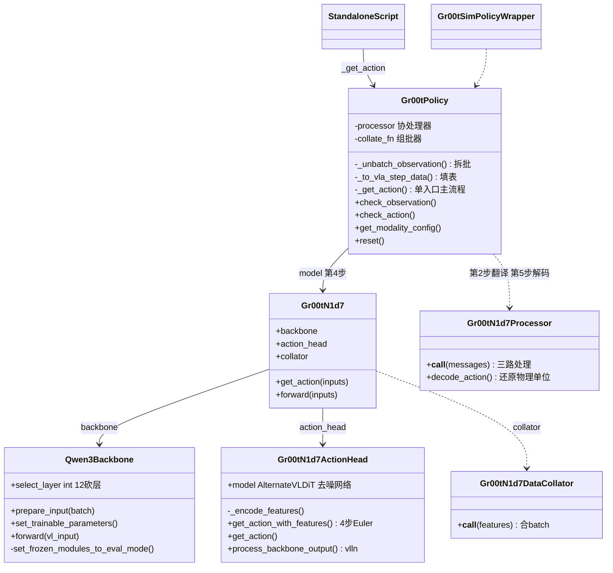
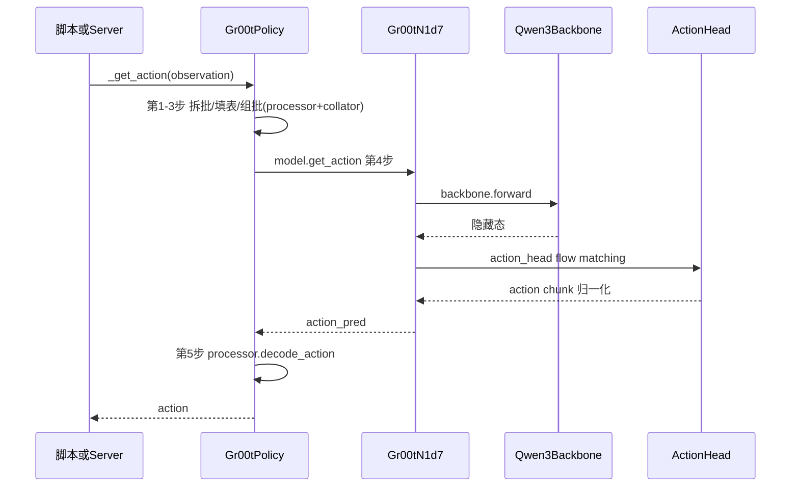
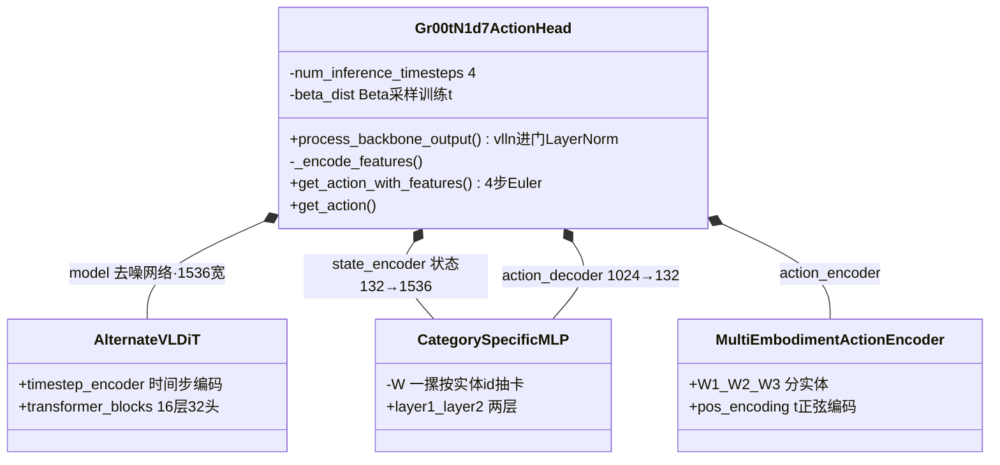
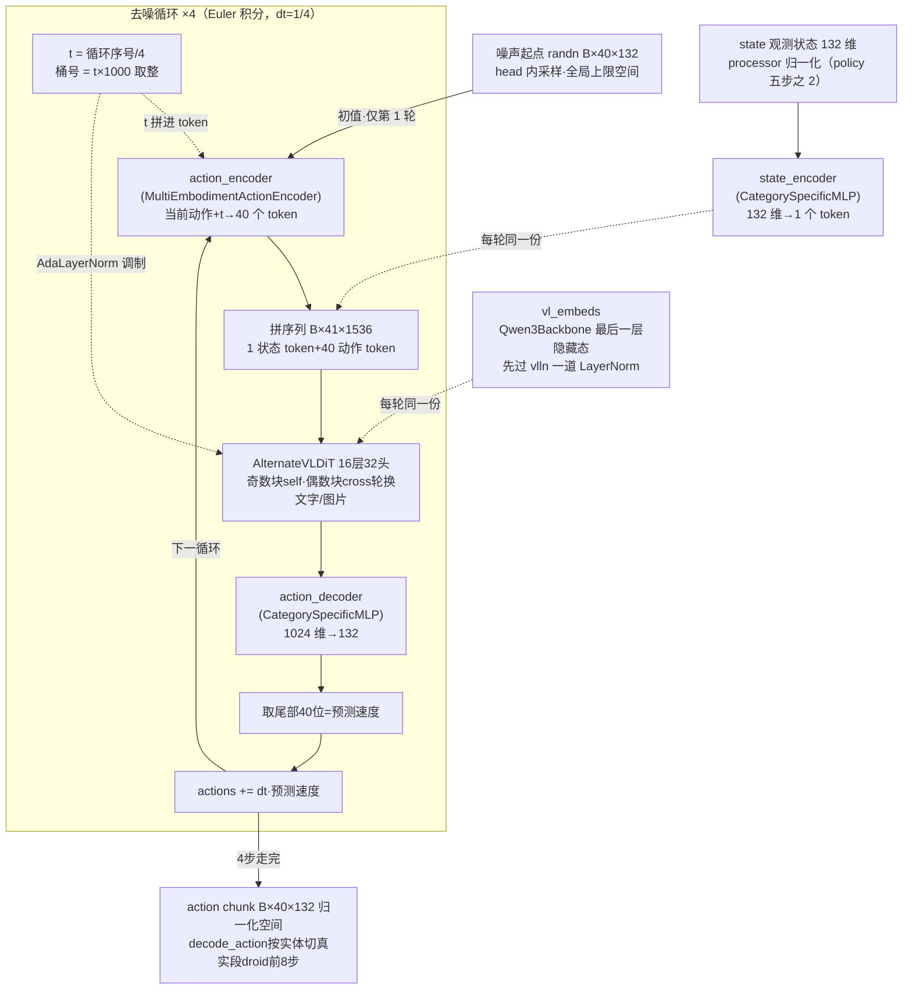
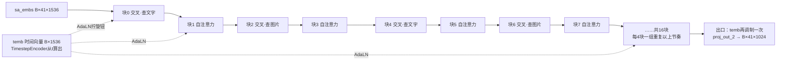
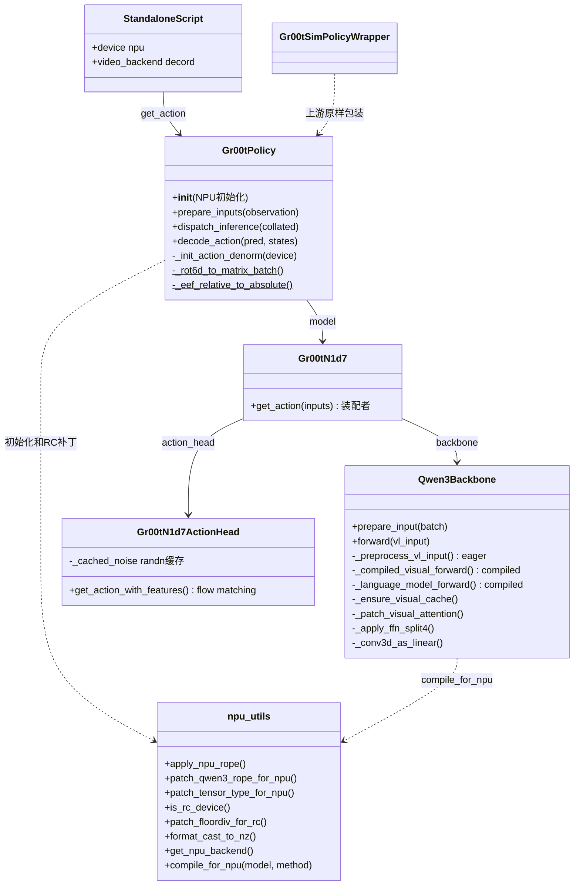
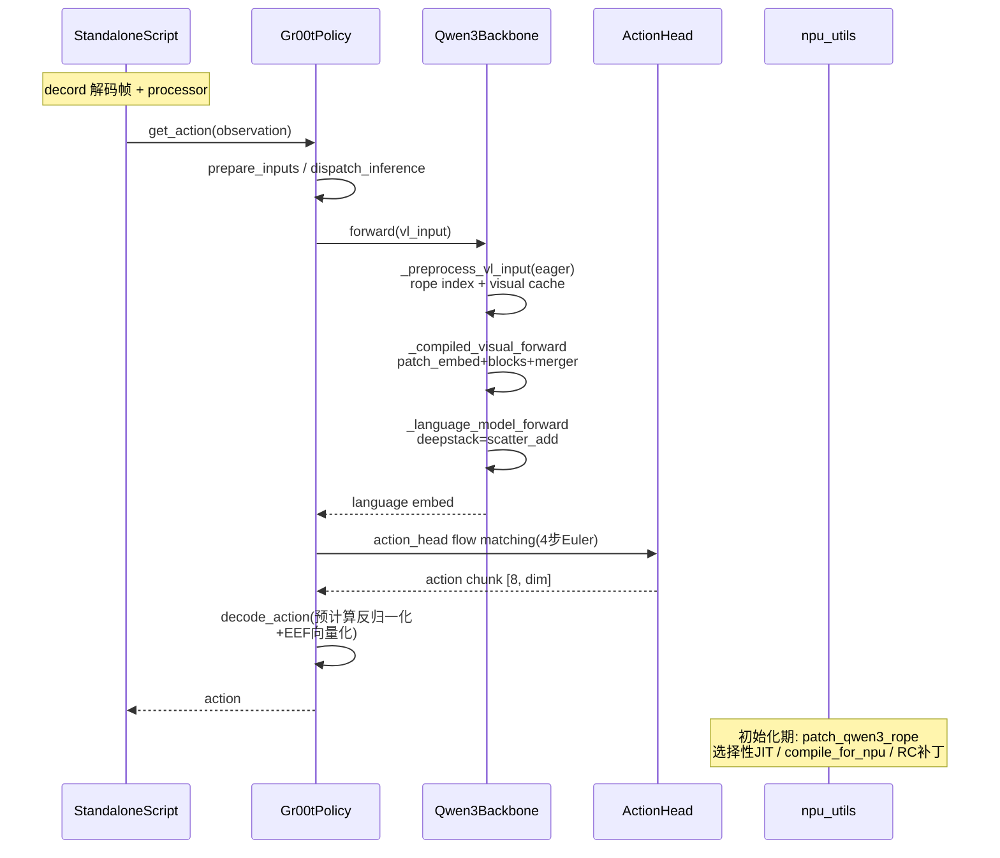
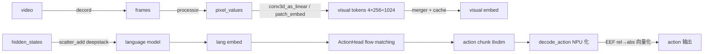

# GR00T N1.7 昇腾 NPU 适配 设计说明书

> 本文件是 skill 的自包含案例快照，同步自 `vla/GR00T_n1d7/syx_docs/GR00T_n1d7_设计说明书.md`（2026-09-08）。skill 独立于任何仓库，快照供其他项目参照结构；源文档演进后需手动同步。

> **重建文档**（2026-08-27）：本文按 design-spec 规范重建，类/方法名取自现存代码（`Isaac-GR00T` 仓库 `npu_adapt` 分支），行为描述来自 git 提交与两份幸存文档；推断处已标注。背景见 [README](README.md)。

# 第一部分：原仓设计（上游）

> 背景简述：只写到理解第二部分所需的最小程度，细节以上游仓库（Isaac-GR00T，自带 CLAUDE.md）与幸存 summary 的架构理解为准。上游为 GPU/CUDA 设计，无 NPU 分支。

## 1. Story（上游）

> Isaac GR00T N1.7-3B 是 NVIDIA 的开源 VLA（视觉-语言-动作）模型：接收视频帧与机器人状态，经视觉-语言骨干与 <a id="back-term-flowmatching"></a>[flow matching](#term-flowmatching) 扩散头，输出动作块（action chunk）。

## 2. 组成与推理流程（上游）

| 组件 | 职责 |
|---|---|
| Gr00tPolicy | 推理策略入口：`_get_action` 一体式五步管线（见类说明） |
| Gr00tN1d7 | VLA 模型本体（PreTrainedModel）：装配 backbone + action_head + collator，`get_action` 转发两跳 |
| Qwen3Backbone（VLM） | visual 编码 + LM，视觉 token 注入语言流，出隐藏态 |
| Gr00tN1d7ActionHead | 状态编码 + flow matching 扩散去噪 → action chunk（归一化空间） |
| Gr00tN1d7Processor / DataCollator | 三路翻译与还原物理单位（第 2/5 步）、合 batch（第 3 步） |
| 评测双入口 | standalone 脚本 / server-client（run_gr00t_server + open_loop_eval） |

类结构（方法清单抽自上游基线 commit `3df8b38`，git 实证）：



**图：上游类结构（组件级）**

图例：实线箭头 = 持有/直接调用；虚线箭头 = 弱依赖（参数传入/转发）。类说明：<a id="back-cls-p1-gr00tpolicy"></a>[Gr00tPolicy](#cls-p1-gr00tpolicy) · <a id="back-cls-p1-gr00tn1d7"></a>[Gr00tN1d7](#cls-p1-gr00tn1d7) · <a id="back-cls-p1-qwen3backbone"></a>[Qwen3Backbone](#cls-p1-qwen3backbone) · <a id="back-cls-p1-actionhead"></a>[ActionHead](#cls-p1-actionhead) · <a id="back-cls-p1-processor"></a>[Processor/Collator](#cls-p1-processor) · <a id="back-cls-p1-simwrapper"></a>[Gr00tSimPolicyWrapper](#cls-p1-simwrapper)。

推理时序（组件级，方法细节以上游代码为准）：



**图：上游推理时序**

**与第二部分的对照点**：上游 `_get_action` 一体式单入口；本仓拆成 `prepare_inputs → dispatch_inference → decode_action` 三段，为的是在中间插进 eager/编译边界（见第二部分 §5「编译边界」）。

## 3. 类说明（上游）

<a id="cls-p1-gr00tpolicy"></a>
**Gr00tPolicy**（BasePolicy 子类）——推理策略入口。`_get_action(observation)` 一体式主流程（读自基线 `3df8b38` 源码，实证）：

1. **拆批** `_unbatch_observation`：按 video 键推断 B，把 `(B,…)` 的 video/state/language 逐条切成 B 份单观测
   - 结构：`video={"cam_high": (B,T,H,W,C), …}` 多相机、`state={"joint_pos": (B,T,D), …}` 多键、`language=(B,T)`；B 从 video 第一个键的 `shape[0]` 推断（无显式字段）。例：`B=2` 的 `(2,1,392,392,3)` → 2 份 `(1,392,392,3)`
   - 动机：下一步 `processor(messages)` 一次只吃单条（HF 接口按单样本设计），所以先拆、逐条处理、第 3 步再 `collate_fn` 合回 batch
2. **转 VLAStepData** `_to_vla_step_data`：单观测 → VLAStepData，再过 `processor(messages)` 逐条处理
   - 填表：五个格子——图片格 = 观测的 `video` 字典挂为 `images` 字段、状态格 = `state` 字典挂为 `states`（传引用不复制：同一块内存从"观测 dict 的键"换挂到"对象字段"上，零字节移动）、指令格抄当前那句字符串、**答案格留空**（训练时放人类示范动作，推理正等着模型给答案——同一张表两种用法，这就是上游训练/推理共用一套代码的方式）、型号格填实体名（翻译环节据此查关节数与每维取值范围）。函数零计算
   - `processor` 三路处理（读码实证，`Gr00tN1d7Processor`）：图片 → PIL → 裁剪缩放 → `pixel_values`；语言 → 对话模板（`apply_chat_template`）→ 文字变编号序列 `input_ids`（多条样本左侧补齐）；状态 → 各键按实体统计量缩放到统一区间（minmax / mean_std，`use_mean_std` 开关——与第 5 步 decode 用同一套统计量），各键拼接后**补零到 max_state_dim=132** 的全局上限宽度（多实体状态维数各异，补零对齐后 action head 的分实体权重才能按统一宽度切；action 侧同机制，`max_action_dim` 也是 132）
   - 调用处同时把**原始未缩放** state 存进列表——第 5 步 `decode_action` 还原物理单位的伏笔
3. **组批** `collate_fn` 合成模型 batch，`_rec_to_dtype` 统一转 **bfloat16**
   - 为何拆了又合：两段对数据粒度的要求相反——processor 一次吃一条（逐条翻译），模型一次吃一批（B 叠在第 0 维才并行）。拆是迁就处理接口，合是喂饱计算胃口，目的不同，不是原地打转
   - 怎么合（`Gr00tN1d7DataCollator`，读码实证）：文字/图片走 HF processor 合并——长短不一的句子**左侧补齐**到同长、图片数对齐；状态/动作直接 `np.stack`，`(T,D)` 摞成 `(B,T,D)`
   - bfloat16：模型权重是 bf16，`_rec_to_dtype` 递归遍历嵌套 batch 把所有张量转成同 dtype，输入与权重一致，避免逐算子隐式转换
4. **推理** `torch.inference_mode()` 下 `model.get_action(**collated_inputs)`，输出 `action_pred`（归一化空间）转 float32
5. **解码** `processor.decode_action`：用 batched states 把归一化动作还原成物理单位，转 float32，返回 `(actions_dict, {})`

配套方法：

- `check_observation` / `check_action`：结构校验——obs 要求 video `uint8 (B,T,H,W,C)`、state `float32 (B,T,D)`、language `(B,T)` 字符串；action 要求各 key `float32 (B,T,D)`（B 批 / T 动作步数 / D 动作维）
- `get_modality_config`：按 embodiment 返回模态配置（决定 state/action 的键与维度约定）
- `reset`：清内部状态

[↩ 返回类图](#back-cls-p1-gr00tpolicy)

<a id="cls-p1-qwen3backbone"></a>
**Qwen3Backbone**——VLM 骨干包装（读自基线 `3df8b38` 源码，实证）：把 transformers 的 Qwen3VL 装进 `nn.Module` 壳，管加载、截层、冻结，加一个一体式 forward。

- **构造**：`from_pretrained` 加载整个 Qwen3VL（注意力后端：可选 flash-attn——CUDA 专用 kernel，未装则回退 sdpa，即 PyTorch 自带的融合注意力算子；NPU 上 flash-attn 不存在，适配首笔提交即移除该分支）
  - **LM 砍层**：`while len(language_model.layers) > select_layer: pop(-1)`——尾部层物理删除，省算力。层数链（读码实证）：`Gr00tN1d7Config.select_layer` 默认 **12** → `Gr00tN1d7.__init__` 转交 → backbone 执行。层数放在配置层的原因：backbone 是 Cosmos/Qwen3-VL 共用的通用件，砍几层属于"用多大骨干"的产品决策，通用件不该自己定
  - 默认不训练任何参数（`tune_llm/tune_visual=False`：语言塔与视觉塔的参数都设为不可训练 `requires_grad=False`，加载的权重原样用于推理）
- **`prepare_input`**：一行，dict 包 BatchFeature
- **`forward`**（核心，仅 ~20 行）：挑 4 个张量（`input_ids` 文字编号 / `attention_mask` / `pixel_values` 图片矩阵 / `image_grid_thw` 网格尺寸）→ **一次调用** `self.model(**vl_input, output_hidden_states=True)`，transformers 内部一口气完成视觉编码（Conv3d → 24 层 blocks → merger；merger 后每图 256 token、4 图共 1024——token 数由 attention reshape 代码实证，24 层数字来自旧案例快照、未本地复核）→ deepstack 注入 → 全部 LM 层 → 取最后一层隐藏态 `[B, T2, hidden]`（T2 = 图片 token + 文字 token 总数），连同 `image_mask`（哪些位置是图片 token）与 `attention_mask` 返回。推理不经 `lm_head`（词表投影头）——VLA 拿隐藏态喂动作头，不做文本生成，文本头天然闲置

**对第二部分的意义**：上游把视觉+语言全压在 `self.model(**vl_input)` 一行里，而这行内部含 transformers 动态代码（`.type()` 等），dynamo trace 不了——第二部分的三段拆分拆的就是这一行：visual / LM 各自成可编译段，动态部分前置为 eager 预处理。上游"一行"与本仓"三段"是这个类的前后两世。

[↩ 返回类图](#back-cls-p1-qwen3backbone)

<a id="cls-p1-gr00tn1d7"></a>
**Gr00tN1d7**（PreTrainedModel）——VLA 模型本体，`Gr00tPolicy.model` 指向的就是它（读码实证）。构造即装配三部件：`backbone`（`get_backbone_cls` 按 model_name 选类，N1.7 → Qwen3Backbone）+ `action_head`（Gr00tN1d7ActionHead）+ `collator`（Gr00tN1d7DataCollator）。`get_action` 把 backbone 输出的隐藏态交给 action_head 走 flow matching——策略层眼里的一句 `model.get_action`，在它这里是"骨干编码 → 扩散头出动作"两跳。

[↩ 返回类图](#back-cls-p1-gr00tn1d7)

<a id="cls-p1-actionhead"></a>
**Gr00tN1d7ActionHead**——动作生成头（读码实证：`gr00t/model/gr00t_n1d7/gr00t_n1d7.py` 本体 + `modules/` 下 dit / flowmatching_modules / embodiment_conditioned_mlp 三个配套件；勘误：此前本文误记"backbone_2（DiT）"——没有与 backbone 平级的第二骨干；但 head **内部确实装着一个 DiT**（`self.model`，[AlternateVLDiT](#cls-p1-altdit)，角色是去噪网络）。它把 backbone 输出的视觉+语言 token 和机器人状态翻译成 action chunk，训练/推理同头：训练在 `forward` 加噪学速度场，推理在 `get_action` 从噪声积分回动作（docstring 原话 "Generate actions using the flow matching diffusion process"）。

**装配**（构造函数，源码实证；维度与角色挂在关系标注上）：



**图：ActionHead 装配关系**

图例：菱形实线 = 组合（构造时装配为自身属性）。backbone 输出进门先过 `vlln` 一道 LayerNorm（`use_vlln=True`；`vl_self_attention` 默认 Identity 未启用）；`use_alternate_vl_dit=True` 默认走 <a id="back-cls-p1-altdit"></a>[AlternateVLDiT](#cls-p1-altdit)（内部三件套与 16 块节奏见其下钻段），另一档是普通 DiT。零件内部的走法见「ActionHead 去噪循环数据流」图。

**多实体机制**（CategorySpecificLinear，`embodiment_conditioned_mlp.py`）：装配图里 state/action 编解码三个 MLP 的权重不是一张矩阵，是一摞——`W: [实体数, in, out]`，前向按 `embodiment_id` 从摞里抽出该实体的那张做批量矩阵乘。为什么分摞：一个头服务最多 32 种机器人（`max_num_embodiments=32`），各家动作维度的含义完全不同（机械臂第 7 维可能是夹爪，人形第 7 维可能是髋关节），共享权重会互相污染。两端（状态编码 / 动作解码）分实体，中间的 DiT 全实体共享——它处理的是已翻译成统一宽度的 token，不再接触实体差异。

**训练 `forward`（学速度场）**：拿示范动作 actions，配随机噪声 noise 与时刻 t，两个式子：

- 加噪轨迹 `noisy = (1−t)·noise + t·actions`——t 越小越接近纯噪声，t=1 是真动作，中间线性插值
- 训练目标 `velocity = actions − noise`——直线插值对 t 求导是常数，即"从混噪点直奔真动作"的方向处处相同；网络要学的就是在任意 (noisy, t) 处报出这个方向

损失 = MSE(预测速度, velocity) × action_mask（132 维中只算该实体真实占用的维）。时刻 t 采样自 `Beta(1.5, 1.0)` 再映射 `(1−x)·noise_s`（noise_s=0.999），分布偏向小 t（高噪声端）；喂编码器前连续 t 乘 `num_timestep_buckets=1000` 取整成<a id="back-term-bucket"></a>[桶号](#term-bucket)。另有 `state_dropout_prob=0.8`：训练时八成概率把整条状态特征置零——逼模型不能只靠状态外推动作，必须看图。

**推理 `get_action_with_features`（从噪声走到动作）**——数据流（源码实证，shape 为 config 默认）：



**图：ActionHead 去噪循环数据流**

输入分三种角色（看连线标注）：**初值**——噪声仅作第 1 轮起点，之后每轮吃上轮 Euler 更新结果（回环箭头）；**循环不变量**——标"每轮同一份"的 vl_embeds 与状态 token，循环外只算一次、每轮参与运算但值不变；**循环变量**——actions（回环更新）与 t（循环序号派生），每轮变。

文字只补图放不下的三件事：

- 时间步为什么拼进 token：同一个网络必须区分"刚开始去噪"和"已走到一半"，否则方向报不准
- 为什么取尾部 40 位：序列头部那个位置是状态 token，它只当上下文不产出动作
- 状态为什么只占 1 个 token：`state_history_length=1`，整个状态向量展平编码成独占一个 token

起点是纯随机噪声，由 head 自己的代码开头现造（`torch.randn` 摇骰子，不从外部传入——三个输入里另两个各有上游，唯独它自产；代码注释原话 "Set initial actions as the sampled noise"）；40 步 × 132 维是全局上限空间，所有实体从第 0 步、第 0 维起连续占用各自的段。为什么 4 步就够（对照传统扩散）：训练目标本身是恒定速度的直线，路径不弯，欧拉积分几步走准；DDPM 类曲线路径要几百上千步——这是选 flow matching 的核心收益（术语表 [flow matching](#term-flowmatching)）。部署侧可经 standalone 脚本 `--denoising_steps` 覆盖步数（直接改 `action_head.num_inference_timesteps`，默认 4；开发期实验过 4→1，未成默认）。

推理代码里另有 RTC 分支（输入带上一 chunk 动作时：把上一段尾部若干步直接填进初始噪声、开头若干步速度置零冻结、中间指数爬坡）——上游为闭环实时控制设计的机制，本仓离线评测不触发，仅定位不展开。

<a id="cls-p1-altdit"></a>
**下钻：去噪网络 AlternateVLDiT 本体**（读自基线 `modules/dit.py`；名字来历：DiT = Diffusion Transformer，Diffusers 社区对"时间步调制的 transformer 去噪器"的通用叫法，AdaLayerNorm 调制是 DiT 论文的标志性设计——领域常识；Alternate 指"文字/图片分开看"的变体）。它的输入就是去噪循环图里"拼序列"节点拼好的 41 个箱子——40 从哪来、1 从哪来在那张图里：`action_encoder` 出的 40 个动作 token 跟在 `state_encoder` 出的 1 个状态 token 后面，沿序列维拼一条（源码 `torch.cat((state_features, action_features), dim=1)`），状态 token 排第 0 位。上一张图里它是黑盒，内部是三件套：

- **TimestepEncoder**（把一个整数变成一个向量，内部两步，读码实证）：
  - 输入就是 t 的[桶号](#term-bucket)。先澄清 t 是什么：代码惯称 timestep（时间步），但量的**不是物理时间**——视频第几帧、控制第几毫秒都与它无关；它量的是去噪进度这条虚拟轴：0=纯噪声端、1=真动作端（推理 4 步循环毫秒级走完）。桶号（0~999 的整数）即"这条查询在这条轴上走到第几格"batch 里每条样本——一次观测：图像 + 状态 + 指令——带一个桶号，张量形状 `(B,)`：batch 维上每条占一格，除批次外没有别的维度。每条只需这一个数：去噪是整条序列一起走的，41 个 token（1 状态 + 40 动作，见去噪循环图）同一时刻处在同一进度，不需要每个 token 各报一份
  - 第一步（波形编码）：把这个整数摊成 256 个数——取 128 个振荡频率（ω 为构造时定死的常数，从 ω=1 按固定倍数递减到约 0.0001），对给定 t 逐一算 `sin(ω·t)` 与 `cos(ω·t)`，128 对共 256 个数；换一个 t，这 256 个式子全部重算
    - 为什么不直接用整数：网络吃整数，学不到"100 与 101 近、100 与 900 远"——那只是两个无关的标签。波形编码后，远近是测出来的：100 与 101，只有最快的几个频率来得及变化，两个向量几乎重合；100 与 900，连最慢的频率都拉开了，差异大。且相似程度只看格差——第 5 格与第 105 格的相似度，恰好等于第 200 格与第 300 格的（快频率管"分辨相邻"，慢频率管"分辨两端"，各司其职）
    - 效果：相邻时间点的输入几乎一样，网络在相邻桶上的行为自然平滑衔接——速度场随去噪进度渐变，而不是 1000 个互不相关的档位各背一套答案。transformer 位置编码同款手法，那边编"在序列第几位"，这边编"去噪到第几格"
  - 第二步：过一个小加工厂，两层 <a id="back-term-mlp"></a>[MLP](#term-mlp)——第一层乘一张矩阵把 256 个数变成 1536 个（Linear 就是"乘固定矩阵 + 加一串偏移"），夹一道 SiLU 激活把数平滑压弯（不压弯的话两层矩阵乘可直接并成一层，网络就白搭了），第二层再乘一张矩阵收尾，落成 1536 个数，即时间向量 temb `(B, 1536)`。一条样本一个向量、全序列共用。跟 token 序列一对照关系就清楚了：序列 `(B, 41, 1536)` 是流水线上 41 个箱子，每个箱子装着自己的 1536 个数（1 个状态 token + 40 个动作 token，各有各的内容）；temb `(B, 1536)` 只有一箱，且不上流水线——它是站在旁边调机器的。宽度之所以也做成 1536：下一步 AdaLN 要把它换算成 scale/shift 两个旋钮，一格对一格地拧每个箱子里的数，宽度必须跟箱子对齐
  - t 因此进了两次：action_encoder 把 t 编进每个动作 token（注意力算内容时"看得见"进度），temb 走 AdaLN（每层旋钮随进度变）——一个管"看的内容"，一个管"层怎么调制"
- **AdaLayerNorm**（Adaptive LayerNorm，自适应层归一化；DiT 共 16 块，每块开头各配一个自己的——全网 16 个、参数各自独立，temb 进每块前都先被该块的旋钮拧一次）：
  - 先说 LayerNorm 本体：对每个箱子里的 1536 个数做规范——减均值、除标准差，整箱拉回均值 0、方差 1，防止数值逐层传递越滚越大。普通 LayerNorm 之后还带两个**固定的**可学参数 scale/shift 做微调（整箱乘一下、加一下），训练完就定死
  - Ada 版改的就是这两个参数的**来源**：不再定死，改成从 temb 现算——`temb → SiLU → Linear(1536→3072)`，3072 = 1536×2，劈成两半得 scale、shift 各 `(B, 1536)`
  - 作用公式 `x = LayerNorm(x)·(1+scale)+shift`：先规范，再逐维乘 (1+scale_d)、加 shift_d——scale 管伸缩、shift 管平移；写成 1+scale 是让 scale 取 0 时原样通过（恒等起步，训练好起步）
  - 效果：同一套 16 层权重，不同去噪进度算出不同旋钮——早期噪声大是一种处理姿势，后期接近真动作是另一种，等于让网络随进度"变形"，不用给每个 t 单独存一套权重。时间步就这样拧进了每一层，而不掺进 token 流
- **BasicTransformerBlock**（16 块同款的标准处理单元：41 个箱子进、41 个箱子出，宽度 1536 不变）：
  - 块内流程（源码实证）：入口 AdaLN（temb 旋钮）→ attn1 注意力 → **残差相加** → 普通 LayerNorm → FFN → **再残差相加**
  - attn1 用的是 diffusers 的通用 Attention 模块，机制本身是 transformer 的心脏，拆开讲：
    - 每个箱子想更新自己，就去查一圈。查什么由 **Q**（Query，查询）描述——自己的内容乘一张矩阵算出；被查方每个箱子备着 **K**（Key，键："我有什么"）与 **V**（Value，值："能从我这里拿走什么"），也各由一张矩阵从内容算出
    - 查找动作：我的 Q 跟每个 K 算相似度（点积），softmax 把一排分数压成总和为 1 的权重，再按权重把各家的 V 加权混合——混合结果就是我带走的新信息
    - 具体一例（示意，token 内容并无人类语义）：某个动作 token 的 Q 大意是"目标物体在哪"，扫过 backbone 的 K，与"红色方块在左上"那条相似度高、分到的权重大，它对应的 V（那片视觉特征）就被大量混进这个动作 token——动作由此"知道"该往左上伸手
    - 本网络**自注意力和交叉注意力两种都用**，按块固定分工（读码实证）：16 块一奇一偶交替——奇数 8 块跑**自注意力**："自"指被查方（K/V）与查询方（Q）来自**同一批**箱子，不是"各查各的自己"——每个箱子查的是全部 41 箱、含自己在内，40 步动作借此对齐节奏、协调整段轨迹；偶数 8 块跑**交叉注意力**："交叉"指跨过批的边界——Q 仍来自动作箱这批，K/V 换成 backbone 那**另一批**（动作箱的 Q 去查另一批的箱子），Alternate 变体再分流：4 块查文字 token、4 块查图片 token。分界线就一条：K/V 跟 Q 是否同批。分工是构造时焊死的：偶数块给 K/V 配吃 2048 维输入（backbone 宽度）的投影矩阵、每轮必喂 vl_embeds；奇数块不配这张矩阵（`cross_attention_dim=None`）、永远互查。整段节奏见下方「AlternateVLDiT 16 块节奏」图
    - backbone 信息进入这张去噪网络的**唯一入口**就是那 8 个偶数块：backbone 的输出（源码变量名 vl_embeds，即去噪循环图 VL 节点——Qwen3Backbone 最后一层隐藏态）只作为交叉注意力的 K/V 被查（进 head 前先过 vlln 一道 LayerNorm），其余一切——temb 时间通路、奇数块自注意力、FFN、出口调制——都不接触 backbone。注意这跟上游 LM 里的注入方式相反：backbone 骨干内部视觉 token 是 deepstack/scatter_add **写进序列座位**的；到了 DiT，backbone token 不占序列座位，只在旁边当**可检索的资料库**
    - 这 41 个箱子跟 LLM 的 token 类比着看：LLM 一句话是 N 个词，这里 41 箱是**一段未来轨迹**——1 个状态箱（机器人此刻的关节/末端读数，132 维压成 1 箱）+ 40 个动作箱（未来 40 步、每步 1 箱）；时间 t **不在箱子里**，走 temb 旁路（见上）。箱子间的联系是**运动学连贯**，对应 LLM 的语义连贯：相邻步关节连续不瞬移、整段朝同一目标不中途反向。40 个动作箱各带序号（action_encoder 之后加的位置编码，`arange(0..39)`；状态箱排在第 0 位不带）——注意力本身不感知顺序（打乱箱子集合结果不变），靠序号才能利用"相邻步该相似"，与 LLM 给词编位置同款。自注意力每轮去噪都在 40 步之间拉齐：整段轨迹作为一个图案同步显影，而不是 40 张独立照片各自显影
    - 32 个头并行：把 1536 维切成 32 份 48 维，每头在自己的子空间独立做一场上述查找（各配各的 Q/K/V 矩阵，关注不同模式——有的盯位置、有的盯颜色纹理），结果拼回 1536 再过一张融合矩阵
  - 两道残差（把块的输入原样加回输出，注意力一道、FFN 一道）：给梯度留直通车道，16 块的深网络才训得动；同时每块学的是"给输入补一份修正量"，而不是从头重算
  - FFN：注意力之后的 [MLP](#term-mlp)，配方 Linear → gelu-approximate → Linear（GELU 的 tanh 近似版，SiLU/ReLU 同族的激活）。分工：注意力管**箱子之间**交换信息，FFN 管**每个箱子内部**逐位置深加工、不跨箱子——一横一纵配成一对

**波形编码举例**（把上面 TimestepEncoder 第一步完整走一遍）。动作本身很简单：每道"频率"就是一条正弦波 sin(ω·t)，ω 是波的快慢——ω 大波纹密，t 挪一格读数就大变；ω 小波纹疏，t 挪很多格读数都懒得动。"摊成 256 个数"就是让 128 道疏密不同的波各读一次 t，每道记 sin、cos 两笔。拿 3 道波（真实 128 道）和 3 个桶号试（数值为约数）：

| 桶号 t | 密波 ω=1 | 中波 ω=0.01 | 疏波 ω=0.0001 |
|---|---|---|---|
| 100 | −0.51 | 0.84 | 0.010 |
| 101 | +0.45 | 0.85 | 0.010 |
| 900 | 0.96 | 0.41 | 0.090 |

读表：竖着比 100 与 101（相邻格）——密波列从 −0.51 翻到 +0.45，翻天；中波 0.84→0.85、疏波纹丝不动，**相邻格的差别全写在密波列里**。隔行比 100 与 900（两端）——疏波列 0.010→0.090 拉开 9 倍，中波 0.84→0.41 也拉开，**远距的差别写在疏波列里**。于是两个桶号的 256 维向量像不像，完全由"差几格"决定：差 1 格几乎重合（只有密波那几维不同），差 800 格处处不同——这就是"远近是测出来的"的意思。

16 块的节奏在**构造时焊死**（源码：奇数块以 `cross_attention_dim=None` 构建，物理上不含交叉权重，不是运行时选择）：



**图：AlternateVLDiT 16 块节奏**

偶数块交叉注意力看 backbone，Alternate 变体再分流：idx%4==0 看文字 token、idx%4==2 看图片 token（即"每 2 个交叉块轮换对象"）；奇数块纯自注意力。文字/图片两堆怎么来的：backbone（吃图 `pixel_values` + 文字 `input_ids` 两种输入）输出的是**一条混排序列**——图片 token 与文字 token 混在一条里，并附带 image_mask 标记哪些位置是图片 token；AlternateVLDiT 拿这张 mask 把序列拆回两堆分别查（源码 `image_mask & mask` / `~image_mask & mask`）。两堆规模很不对称：droid 单张图就有 576 个图片 token，文字指令只有一小串。出口处 temb 经 proj_out_1 再调制一次（scale/shift），proj_out_2 把 1536 降到 1024 交给 action_decoder。

[↩ 返回装配图](#back-cls-p1-altdit) · [↩ 返回类图](#back-cls-p1-actionhead)

<a id="cls-p1-processor"></a>
**Gr00tN1d7Processor / Gr00tN1d7DataCollator**——翻译与组批（细节在 Gr00tPolicy 五步里，此处只定位）：processor 第 2 步三路翻译（图片/语言/状态）、第 5 步 `decode_action` 还原物理单位；collator 第 3 步合 batch。Gr00tN1d7 构造时也自持一份 collator 供自身 `prepare_input` 用（上游注释自嘲 eval 路径没走 collator，属历史遗留）。

[↩ 返回类图](#back-cls-p1-processor)

<a id="cls-p1-simwrapper"></a>
**Gr00tSimPolicyWrapper**（PolicyWrapper 子类）——仿真评测包装：构造时接收一个 Gr00tPolicy，转发 `_get_action`，并对 observation/action 做严格校验（strict 模式）。

[↩ 返回类图](#back-cls-p1-simwrapper)

# 第二部分：本仓适配设计

## 1. Story 描述

> 本系统把 NVIDIA Isaac GR00T N1.7-3B（VLA 机器人模型）的推理移植到昇腾 NPU：通过 forward 拆分 + torchair 图编译，最终在 200I PRO 上做到单步 **161.5 ms、MAE 0.056034**——快于 A10 参考（263.8 ms、MAE 0.055992），并适配 DUO / RC 两种低端卡。（上库 README 口径；过程数字 eager ~36s → 选择性 JIT ~1.55s → 全编译 440ms → 200ms 见 architecture.md §4）

## 2. Story 上下文

- **应用场景**：机器人操控策略的离线/在线推理评测（standalone 与 server-client 两种入口）
- **输入**：视频帧序列（decord 解码）+ 状态字典（关节/EEF）
- **输出**：<a id="back-term-action-chunk"></a>[action chunk](#term-action-chunk)（horizon=8，<a id="back-term-eef"></a>[EEF 相对→绝对](#term-eef) + <a id="back-term-denorm"></a>[反归一化](#term-denorm)后）
- **运行环境**：NPU（DUO / Atlas 200I RC，torch_npu==2.7.1.post4）；GPU 基线 A10
- **性能目标**：对齐乃至超过 A10（README 参考 263.8 ms/step，适配期实测 259ms）；实际达成 **161.5 ms/step**（含流水线重叠贡献 ~42ms）
- **核心约束**：torchair/dynamo 无法 trace 上游 transformers 的动态控制流；低端卡缺 Conv3D binary；fp16 硬件舍入不可消除

## 3. 功能点分解

### 设备与初始化
1. **NPU 初始化序列**：`.to('npu')` 与 `.half()` 拆分且有序（`.npu()` 会重置 half 权重）
2. **RC 设备补丁集**：`is_rc_device()` 检测、`patch_floordiv_for_rc()` 地板除、`_rot_pos_emb_cpu_safe`

### 编译与执行
3. **forward 三段拆分**：eager 预处理 / compiled visual / compiled LM（绕 dynamo setattr 边界）
4. **Conv3D 选择性 JIT**：整网 jit=False，仅 patch_embed 临时切 True（36s→1.55s）
5. **torchair 分级编译**：`compile_for_npu()` + compile_level；>=2 时 visual 一并编译
6. **静态 shape 化**：visual attention reshape、visual cache（pos_embeds/cu_seqlens 等）

### 算子与数值
7. **scatter_add 合一**：deepstack 注入三算子→一算子（211→200ms）
8. **FFN split4**：大 MatMul 拆 4 + 等价 gather 替换（含权重切分时序坑）
9. **decode_action 重构**：预计算 scale/offset（numpy 常驻）、EEF 相对→绝对向量化
10. **精度对齐方法**：syx_save/syx_load 对齐输入 + 逐 block diff 定位

### 数据与入口
11. **decord 视频后端**：替换链 CUDA13 的 torchcodec
12. **双入口**：standalone（`--device`）与 server-client（run_gr00t_server / open_loop_eval）
13. **外移部署件**：run_inference.py / hf_download.py（上库准备）

## 4. 类关系图



**图：本仓类关系**

图例：实线箭头 = 持有/直接调用；虚线箭头 = 弱依赖（参数传入/工具性调用）。类说明速查：<a id="back-cls-gr00tpolicy"></a>[Gr00tPolicy](#cls-gr00tpolicy) · <a id="back-cls-qwen3backbone"></a>[Qwen3Backbone](#cls-qwen3backbone) · <a id="back-cls-npu-utils"></a>[npu_utils](#cls-npu-utils)。

**来源对照表**（上游 vs 本仓适配）：

| 类/模块 | 来源 | 说明 |
|---|---|---|
| Gr00tPolicy | 改自上游 | <a id="back-adapt"></a>[NPU 初始化序列](#adapt-npu-init)、[编译开关](#adapt-compile-switch)、[decode_action 重构](#adapt-decode-npu)、[EEF 向量化](#adapt-eef-vec) |
| Qwen3Backbone | 改自上游 | <a id="back-adapt-backbone"></a>[forward 三段拆分](#adapt-forward-split)、静态 shape 化三项（[attention patch](#adapt-attn-patch) / [visual cache](#adapt-visual-cache) / [causal mask 缓存](#adapt-mask-cache)）、[split4](#adapt-split4)、[conv3d_as_linear](#adapt-conv3d-linear)、[2D→3D 张量](#adapt-3d-tensor) |
| npu_utils | **本仓新增** | <a id="back-adapt-npu-utils"></a>[NPU RoPE patch](#adapt-npu-rope)、[type() 补丁](#adapt-type-patch)、[NZ 权重格式](#adapt-nz)、[torchair 编译入口](#adapt-compile)、[RC 补丁集](#adapt-rc-patch) |
| Gr00tN1d7 + ActionHead | 上游原样 | VLA 装配者与动作头（结构详见第一部分 §3） |
| Gr00tSimPolicyWrapper | 上游原样 | — |
| standalone / server / eval 入口 | 改自上游 | `--device` 参数、decord 默认、NPU hook、<a id="back-adapt-entry"></a>[流水线重叠](#adapt-pipeline) |
| run_inference.py / hf_download.py | **本仓外移** | 上库部署件（06-10 `b22c44e`） |

### 4.1 类说明速查

<a id="cls-gr00tpolicy"></a>
**Gr00tPolicy**（`gr00t/policy/gr00t_policy.py`）——推理策略入口。上游 `_get_action` 一体式；本仓拆为 `prepare_inputs`（组批）→ `dispatch_inference`（调度骨干+扩散头）→ `decode_action`（预计算反归一化 + EEF 相对→绝对，见 §5「decode 路径重构」）。NPU 初始化序列在其 `__init__`：dtype 拆分、`npu()`→`half()` 顺序、Conv3D 选择性 JIT patch（展开见 §5 对应小节）。

[↩ 返回类图](#back-cls-gr00tpolicy)

<a id="cls-qwen3backbone"></a>
**Qwen3Backbone**（`gr00t/model/modules/qwen3_backbone.py`）——VLM 骨干。本仓把 `forward` 拆成三段：`_preprocess_vl_input`（eager：rope index、visual cache）→ `_compiled_visual_forward` / `_language_model_forward`（torchair 编译段）；另有 attention 静态 shape patch、FFN split4、conv3d_as_linear。机制详见子系统设计文档 designs/torchair_adaptation.md（本快照不含该文件）。

[↩ 返回类图](#back-cls-qwen3backbone)

<a id="cls-npu-utils"></a>
**npu_utils**（本仓新增，现位于 `vla/GR00T_n1d7/npu_utils.py`）——NPU 辅助函数集：RoPE patch、NZ 格式转换、torchair 编译入口 `compile_for_npu`、RC 检测与补丁（`is_rc_device` / `patch_floordiv_for_rc`）。

[↩ 返回类图](#back-cls-npu-utils)

## 5. 功能实现思路

<a id="adapt-forward-split"></a>
### forward 三段拆分
transformers Qwen3-VL 里 `pixel_values.type()` 触发 torch_npu `_npu_type` 的类级 `setattr`，dynamo 报错。与其 patch 上游，不如**按可编译性切面**：动态控制流（rope index、dtype 转换）留 eager，纯 tensor 段进编译——`_preprocess_vl_input`（eager 预处理）/ `_compiled_visual_forward` / `_language_model_forward` 三段由此而来。放弃过全量编译 backbone（05-26 首次尝试即失败转向拆分）。

[↩ 返回对照表](#back-adapt-backbone)

### Conv3D 选择性 JIT
全局 jit=True 可跑但 36s/step；warmup 后切回 False 则缓存失效复报错（JIT 缓存不跨 compile mode）。定型方案只在算子执行瞬间切模式——代价是 try/finally 包裹，收益是 23 倍提速。compile_level>=2 后整段进图，此 patch 退役。

<a id="adapt-conv3d-linear"></a>
### conv3d_as_linear
先看这个 Conv3d 在干什么：把每张图切成 14×14 的不重叠小块（patch），每块带着 2 帧时序和 3 通道共 3×2×14×14=1176 个数，用同一套 1176 个权重做加权求和——切块称重而已。新旧对照（读码实证）：

**旧算子**（上游 patch_embed 原样）：

```python
proj = nn.Conv3d(3, out_c, kernel_size=(2, 14, 14), stride=(2, 14, 14))  # 定义：3 通道进、核=步长、无 padding
hidden = proj(pixel_values)  # 调用：输入 (N, 3, 2, 14, 14)，每块 1176 个数乘加求和 → (N, out_c)
```

**新替换**（`_conv3d_as_linear`，提交 `51f6273`）：

```python
x_flat = pixel_values.reshape(N, 3*2*14*14)      # 每块拉平 → (N, 1176)
out = x_flat @ proj.weight.reshape(out_c, -1).T  # 拉平的核权重 (1176, out_c)
out = out + proj.bias                            # → (N, out_c)
```

等价看得见：Conv3d 的权重本来就存成 `(out_c, 3, 2, 14, 14)`，拉平即 `(out_c, 1176)` 的矩阵——"窗口内逐元素乘加求和"恰好就是"拉平向量乘矩阵的对应行"。也就是**三个小算子（reshape + matmul + add）拼出了 Conv3d**：reshape 只换内存视图不搬数据、add 是逐元素收尾，计算全部集中在 matmul 一个算子里。kernel=stride、无 padding 保证块与块不重叠、不补边、每块独立称重，两种写法逐位相同；有重叠或补边的卷积就不能这么替。

为什么弃卷积算子：低端卡（RC）缺 Conv3d binary，而 matmul 是通用矩阵乘、哪张卡都有。实现上不新建参数——直接拿原卷积权重 reshape 来用（matmul 而非 `nn.Linear`）。调用点是 `_compiled_visual_forward` 的第一步；compile_level>=2 时 visual 段开头即此替换，选择性 JIT workaround 随之退役。

[↩ 返回对照表](#back-adapt-backbone)

<a id="adapt-attn-patch"></a>
### attention patch
静态 shape 化之一（三项同目的：消灭动态 shape，机制详见子系统设计文档 designs/torchair_adaptation.md §3）。visual attention 的 forward 换成 reshape 版：`[256, nh, hd]` reshape 成 `[4, nh, 64, hd]` 跑 PFA（NPU 融合注意力 kernel，替代 matmul+softmax+matmul），全程静态 shape，不走 `.tolist()+torch.split` 动态切分——动态 shape 是图编译反复 recompile 的源头。结构前提：vision attention 的 QKV 是**合并的单个 Linear**（`attn.qkv`，一次投影出三份再 reshape 拆开）——PFA 版正建在这个合并投影上。演化注：PFA 之前曾显式拆成 matmul + `softmax(float32)` + matmul 以保两平台 softmax 行为一致（旧案例快照记录的中间态），PFA kernel 融合后这段不再是显式代码。

[↩ 返回对照表](#back-adapt-backbone)

<a id="adapt-visual-cache"></a>
### visual cache
静态 shape 化之二。pos_embeds / position_embeddings / cu_seqlens / split_sizes 等只与图像规格有关的量，首次算好后懒缓存复用。**前提是图像规格恒定**：代码把 grid_thw 硬编码为 4 张 16×16（droid 数据集规格，注释原话 "Fixed grid_thw for the dataset"）——换数据集/分辨率这里要改，缓存本身无 shape 失效检查。

[↩ 返回对照表](#back-adapt-backbone)

<a id="adapt-mask-cache"></a>
### causal mask 缓存
静态 shape 化之三。按序列长度缓存 causal mask，长度变了就重建（`shape[-1] != cur_S`）。代价：B=1 时每步语言指令长短不同，缓存经常 miss 重算——收益打折但保留（`57d865d` 修过它的非多进程 bug）。历史上 PFA 攻坚曾验证"mask 是否纯 causal 无 padding"想更激进地静态化，发现语言左 padding 每步不同而作罢（timeline 阶段 6）。

[↩ 返回对照表](#back-adapt-backbone)

<a id="adapt-3d-tensor"></a>
### 2D→3D 张量
torchair 编译路径下，2D 张量 `[seq, dim]` 过 Linear/LayerNorm 使用的内核精度低于 3D `[1, seq, dim]`。`_compiled_visual_forward` 因此入口 `unsqueeze(0)` 加假 batch 维、出口 `squeeze` 恢复（代码注释原话 "Use 3D tensors for better torchair compiled precision"）。

[↩ 返回对照表](#back-adapt-backbone)

<a id="adapt-compile-switch"></a>
### 编译开关
终态是三个模块级布尔常量（`gr00t_policy.py` 顶部，全 True）加构造参数 `compile=True` 总开关：`_COMPILE_VISUAL_ENCODER` 编 `backbone._preprocess_vl_input`（内含 visual 段）、`_COMPILE_LANGUAGE_MODEL` 编 `_language_model_forward`、`_COMPILE_ACTION_HEAD` 编 `action_head.model.forward`——**DiT 也进编译**，这点容易漏。演化注：开发期曾是 compile_level 0/1/2 数字分级逐级验证精度（旧案例快照记录的中间态），清洗定型为布尔常量；Conv3D 选择性 JIT 只在 visual 不编译时才打（`if is_npu and not (compile and _COMPILE_VISUAL_ENCODER)`），全编译下退役。

[↩ 返回对照表](#back-adapt)

### 精度策略
逐 block 双平台 diff 证明代码正确、差异全来自 fp16 舍入（CPU 上两平台仅差 0.025%）。结论：**接受 0.0094 的 MSE，不在数值上做补偿**——补偿会破坏与 GPU 行为的一致性。

<a id="adapt-split4"></a>
### split4
**是什么**：LM 每层 FFN 的两个大矩阵乘 gate_proj / up_proj（`[6144, 2048]`，2048 维输入 → 6144 维中间层）沿输出维拆成 4 个 `[1536, 2048]` 小矩阵乘（提交 `f2260ed`。勘误：commit message 写"gather 等价替换"，实际代码是 chunk 拆 + `torch.cat` 拼回，从未有 gather）。

**为什么**：小矩阵乘提高 NPU cube（矩阵计算单元）利用率——2048→6144 的大 GEMM 调度效率低于 4 个 2048→1536（docstring 原话 "Improves NPU cube utilization"）。

**怎么做**（读码实证）：FFN 原式是 SwiGLU——`down(silu(gate(x)) · up(x))`；拆后 `down(cat([silu(gᵢ(x)) · uᵢ(x)]，i=1..4))`——gate/up 权重按输出维切块各建独立 Linear（clone 权重），4 段各自过激活和逐元素乘，cat 恢复 6144 维后 down_proj 不动，原大矩阵删除释放显存。数学等价成立的原因：按输出维切分不影响逐元素的 silu 和乘法，拼回即原式。

**坑**：权重切分时序——CPU 切权重再上 NPU vs 先上 NPU 再切，内部格式转换（NZ）时序不同产生数值差。定型为**先上 NPU（格式转换完成）再切**：split4 挂在 `_ensure_visual_cache` 首次推理时执行（代码注释 "Apply FFN split4 AFTER model is on NPU (avoids weight format divergence)"；双路径插桩对比定型，`c6f0bcf`）。

[↩ 返回对照表](#back-adapt-backbone)

<a id="adapt-npu-init"></a>
### NPU 初始化序列
模型加载完成后要上 NPU 并设定精度，本仓按固定顺序做三件事：

1. `model.to('npu')`：把权重从 CPU 搬到 NPU
2. `model.half()`：把权重转成 fp16 半精度。必须排在搬运**之后**——torch_npu 的设备搬运会把已是半精度的权重重置回 fp32，先 half 再 npu 等于白转
3. 加载时就用 `torch_dtype=float16` 预设精度，权重从磁盘读进来即是 fp16——运行期因此不需要 `.type()` 这类动态转精度的调用，而那种动态调用 dynamo 图编译跟踪不了，是「forward 三段拆分」的源头之一

[↩ 返回对照表](#back-adapt)

<a id="adapt-decode-npu"></a>
### decode 路径重构
上游 `decode_action` 在 CPU 用 Python 逐条循环：逐 joint group 查统计量、逐动作步做 `x·scale+offset`——action chunk 化把这个开销按步数放大（head 一次出 40 步）。本仓 `_init_action_denorm` 在初始化时把各 joint group 的 scale/offset 预计算成 numpy 数组常驻（minmax 型 `scale=range/2、offset=min+range/2`，meanstd 型 `scale=std、offset=mean`），连同 is_relative 标志一起存好；`decode_action` 拿预计算参数对整个 chunk 一次向量化完成（含裁剪到 [-1,1]），全程 numpy/CPU——不占 NPU，也没有逐条循环。

[↩ 返回对照表](#back-adapt)

<a id="adapt-eef-vec"></a>
### EEF 向量化
decode_action 尾部的 [EEF 相对→绝对](#term-eef) 换算（概念见术语表），上游是 Python 逐条循环——每个动作步单独做一次旋转转换和矩阵乘，40 步循环 40 遍。本仓两个向量化函数收拢成批量矩阵乘（提交 `c04c57d`，三个 joint group 与旧实现 VERIFY 对比等价），shape 与公式如下（读码实证）：

**`_rot6d_to_matrix_batch`**（6 维旋转 → 3×3 旋转矩阵）：`(B, T, 6)` → `(B, T, 3, 3)`。把末 6 维 reshape 成两个 3 维向量 a、b，Gram-Schmidt 正交化：

- r₁ = a / ‖a‖
- r₂ = (b − (r₁·b)·r₁) 归一化（去掉 r₁ 方向分量）
- r₃ = r₁ × r₂（叉乘）
- R = r₁、r₂、r₃ 三行堆叠

（6D 是网络输出旋转的常用编码：直接回归 9 个矩阵元难以保持正交，6D 经正交化必得合法旋转——领域常识）

**`_eef_relative_to_absolute`**（位姿复合）：输入 denorm `(B, T, 9)`（前 3 维平移 + 后 6 维 rot6d，模型输出的相对增量）与 ref_state `(B, 9)`（参考状态，取最后观测时刻）：

1. 两边各自转旋转矩阵：rel_R `(B, T, 3, 3)`、ref_R `(B, 3, 3)`
2. 各自组装 4×4 齐次矩阵——左上 3×3 放 R、右上 3×1 放 t、右下角 1：T_rel `(B, T, 4, 4)`、T_ref `(B, 4, 4)`
3. **一次广播矩阵乘走完整条 chunk**：`T_abs = T_ref[:, None] @ T_rel` → `(B, T, 4, 4)`——40 步 40 个矩阵乘收进这一次 np.matmul
4. 拆回 9 维：平移取 `T_abs[..., :3, 3]` 得 `(B, T, 3)`；旋转取 R 前两行 reshape 回 rot6d 得 `(B, T, 6)`，末维拼回 `(B, T, 9)`

核心公式 `T_abs = T_ref · T_rel`，展开即 R_abs = R_ref·R_rel、t_abs = R_ref·t_rel + t_ref。

[↩ 返回对照表](#back-adapt)

<a id="adapt-npu-rope"></a>
### NPU RoPE patch
RoPE（旋转位置编码）是每层注意力都过的热路径，transformers 原版用 Python 组合算子实现（cat、乘、加逐个下发），kernel 拼接开销在 NPU 上被放大。本仓替换：`apply_npu_rope` 把 q、k 先 cat 成一份、一次 `torch_npu.npu_rotary_mul`（融合 kernel）算完再 split 回——q、k 共一次下发；`patch_qwen3_rope_for_npu` 在 transformers 的两个候选模块路径里找到 `apply_rotary_pos_emb` 属性直接换掉（不同 transformers 版本模块布局不同，多路径尝试，找不到只告警不崩）。

[↩ 返回对照表](#back-adapt-npu-utils)

<a id="adapt-type-patch"></a>
### type() 补丁
`torch.Tensor.type()` 用在 NPU 张量上会走 torch_npu 的 `_npu_type`——正是触发类级 `setattr`、dynamo 跟不了的那个入口（见「forward 三段拆分」）。本仓把 NPU 张量上的 `.type(dtype)` 重定向到等价的 `.to(dtype=...)`，CPU 张量行为不变——从调用方一侧拆掉炸点，与三段拆分双保险。

[↩ 返回对照表](#back-adapt-npu-utils)

<a id="adapt-nz"></a>
### NZ 权重格式
NPU 矩阵计算单元按 NZ（fractal，分块矩阵）布局吃权重最顺。`format_cast_to_nz` 遍历模型所有 `nn.Linear`，权重经 `npu_format_cast(w, FRACTAL_NZ=29)` 转好常驻（`requires_grad` 置 False），后续 matmul 不再每次运行时重排。split4 的"权重时序坑"与这里是同一个格式转换问题——所以 split4 定型"先上 NPU 再切"。适用范围有过反复（读码+git 勘误）：06-12 曾参数化尝试让 RC 不转（`78bae25`，commit 名"rc上尝试不再转nz格式"），上库清洗时参数删除、恢复**无条件转换——最终态 RC 也转**。

[↩ 返回对照表](#back-adapt-npu-utils)

<a id="adapt-compile"></a>
### torchair 编译入口
`compile_for_npu(model, method_name, fullgraph)`：把模型的**任意方法**用 `torch.compile(dynamic=False, fullgraph=…)` 配 torchair 后端编译后 setattr 换回。"编译哪个方法"参数化正是 forward 三段拆分的落地机制——visual、LM 各自的方法独立进编译；`fullgraph=False` 给复杂段留图断裂余地，整段干净的（如 `action_head.model`）用 True。backend 侧 `CompilerConfig` 开两个推理向开关：`frozen_parameter`（参数冻结）、`tiling_schedule_optimize`（切分调度优化）；另置 dynamo 的 `capture_scalar_outputs` / `capture_dynamic_output_shape_ops`，让标量输出和动态 shape 算子可被捕获。

[↩ 返回对照表](#back-adapt-npu-utils)

<a id="adapt-pipeline"></a>
### CPU/NPU 流水线重叠
原始循环里 CPU 数据准备与 NPU 推理串行。standalone 脚本用 `ThreadPoolExecutor` 在 CPU 线程预取下一步观测（生产者-消费者模式），NPU 跑当前步时 CPU 同时备下一步，重叠出 ~42ms/step（约 9%）。

[↩ 返回对照表](#back-adapt-entry)

<a id="adapt-rc-patch"></a>
### RC 补丁集
RC（Atlas 200I / 310P 嵌入式卡）与大卡行为不同的两处兜底。`is_rc_device()`：跑 `lspci` 找 "accelerators" 设备行，没有即 RC，结果缓存、全仓共用这一判定；`patch_floordiv_for_rc()`：RC 原生 `//` 在 fp16 下结果会错（docstring 原话 "native floor division can produce incorrect results due to fp16 precision loss"），patch 改成先真除再 cast 回原 dtype，保数值正确。

[↩ 返回对照表](#back-adapt-npu-utils)

## 6. 推理调用链



**图：本仓推理调用链**

## 7. 流程说明

### 阶段 1：数据准备（CPU，decord）
视频 → 帧序列 → StateActionProcessor 组 batch；`is_rc_device()` 为真时打地板除补丁。

### 阶段 2：eager 预处理（CPU/NPU 混合）
`_preprocess_vl_input`：get_rope_index、visual cache 命中判断——动态逻辑，不进图。

### 阶段 3：编译段推理（NPU，torchair）
visual（含 Conv3D，level>=2）→ LM（scatter_add 注入）。占总耗时大头，是全部编译优化的对象。

### 阶段 4：生成与解码（NPU + CPU 收尾）
ActionHead flow matching → 结果回 CPU，`decode_action` 用预计算参数一次向量化完成反归一化与 EEF 转换（numpy）。

## 8. 内部数据流



**图：本仓内部数据流**

关键量化点见 architecture.md §4；工程时间线见 dev_logs/summary/2026-05-19_2026-07-01_adaptation_timeline.md（两者均在源仓库 syx_docs，本快照不含）。

## 术语表

<a id="term-action-chunk"></a>
### action chunk

一次推理输出的未来一串动作，而非单步。action head 在全局上限空间一次产出 `[40, 132]`（config 默认 horizon/action_dim 上限），`decode_action` 按实体切出真实段——droid 实体即 8 步，整块处理。动机：推理延迟（~160ms）远大于控制周期，chunk 把一次推理摊到多个控制步上，且整段预测时序连贯；执行按滑窗——走若干步再触发下一次推理。做法源自 ACT（ALOHA，2023），VLA 谱系普遍沿用（领域常识，非本仓记录）。chunk 化也是 `decode_action` NPU 向量化的动机：Python 循环开销按步数放大。

[↩ 返回](#back-term-action-chunk)

<a id="term-eef"></a>
### EEF 相对→绝对

EEF（end-effector）= 末端执行器。`..._RELATIVE_EEF_...` embodiment 下模型输出相对**当前**末端位姿的增量；执行需要绝对位姿 = 参考位姿 ⊕ 增量，旋转部分 6D→3×3 矩阵后做齐次矩阵乘法。本仓实现：`_rot6d_to_matrix_batch` / `_eef_relative_to_absolute` 向量化（提交 `c04c57d`，shape 与公式见 §5「EEF 向量化」），此前为 Python 逐条循环。

[↩ 返回](#back-term-eef)

<a id="term-flowmatching"></a>
### flow matching

动作的**生成式**产出法：不直接回归答案（同一情境多种合理动作会被平均成怪解），而是从随机噪声出发，按训练学到的"每一步往哪个方向挪"（速度场）走若干步，终点即 action chunk（归一化空间）。本仓 ActionHead 的 `get_action_with_features` 即此（代码原话 "Set initial actions as the sampled noise"）。与 GenPose 的分数场+ODE 同族（GenPose 是 score-based，此处是速度场，路径更直、步数更省）。

[↩ 返回](#back-term-flowmatching)

<a id="term-bucket"></a>
### t 桶号（timestep bucket）

去噪进度 t 是 0~1 的连续小数（0=纯噪声端，1=真动作端）。t 惯称 timestep（时间步），但量的不是物理时间——是去噪这条虚拟进度轴上的位置，别被"时间"二字带偏。网络不直接吃这个小数，而是吃"第几格"：把 0~1 想成一把刻了 1000 个格子的尺子，`桶号 = int(t × 1000)`（`num_timestep_buckets=1000`）——t=0.25 就是第 250 格，桶号即格子编号（这类"把连续值按等宽区间归堆、报堆的编号"的做法通用名叫分桶，故得此名）。这个整数随后交给两处用：action_encoder（编进动作 token）、TimestepEncoder（做时间向量）。训练时 t 在 0~1 里随机取值，1000 个格子个个都练过；推理走 4 步，t 固定取 0、¼、½、¾，只落在第 0、250、500、750 这 4 个格子上——都是练过的格子，推理用到的每个时间点，训练时都专门练过。

[↩ 返回](#back-term-bucket)

<a id="term-denorm"></a>
### 反归一化

模型在归一化空间输出动作（训练时按 embodiment 统计量压缩数值范围），执行前映射回物理单位：`x·scale + offset`。minmax 型 `scale=range/2, offset=min+range/2`；meanstd 型 `scale=std, offset=mean`（提交 `c9f2ae4` 的提交信息）。本仓 `_init_action_denorm` 预计算各 joint group 的 scale/offset 存成 numpy 数组常驻，`decode_action` 对整个 chunk 一次向量化完成。

[↩ 返回](#back-term-denorm)

<a id="term-mlp"></a>
### MLP（Multi-Layer Perceptron，多层感知机）

若干层 Linear 变换夹非线性激活堆成的最基础前馈网络（`Linear → 激活 → Linear → …`），1980s 老构件，名字沿用至今；现代 transformer 每块注意力后那段前馈也叫 MLP 或 FFN，混称。配方各异：本文 action head 里是两层版（TimestepEncoder 第二步用 SiLU，CategorySpecificMLP 用 ReLU）；骨干 Qwen3 的 FFN 用 SwiGLU 三矩阵配方（up/gate/down + SiLU 门控）——同族不同配方，看到 MLP 先问"几层、什么激活"。勿与 DeepSeek 的 MLA（Multi-head Latent Attention）混淆：MLA 是注意力机制的变体（KV 压成低秩 latent 省 KV cache），管"怎么注意"；MLP 管注意力之后的"怎么变换特征"，两码事。

[↩ 返回](#back-term-mlp)
