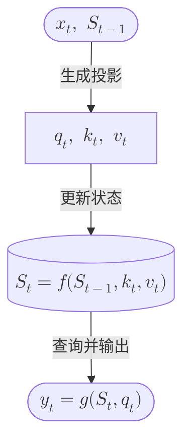

# Diagramming：学习文档中的图示与公式

## 何时读取

当学习文档需要结构图、数据流、调用链、状态变化图，或希望在图中显示数学公式时读取本文件。

## 先按信息关系选载体

图示服务于理解关系，不是装饰。使用最小且足够的载体：

| 要表达的关系 | 首选载体 | 原因 |
|---|---|---|
| 部件、层级、分支、数据去向 | Mermaid `flowchart` | 空间关系和分支比文字清楚 |
| 调用者、返回值、时间顺序 | Mermaid `sequenceDiagram` | 参与者与先后顺序清楚 |
| 每一步的输入、操作、中间值、输出 | Markdown 表格 | 精确、可搜索、跨渲染器稳定 |
| 一条公式的完整推导 | 独立 `$$...$$` 数学块 | 排版空间充足，便于逐行解释 |
| 两三个简单线性步骤 | 编号列表或短表格 | 图不会比文字增加信息 |

同一内容可以使用“图 + 表”，但职责要分开：图回答结构与流向，表回答每步精确做了什么。这不是无意义重复。

## Mermaid 中渲染公式

标记为 `text` 的普通代码围栏会按字面保留内容，其中的 `$x$` 不会渲染。需要在图中显示公式时，默认只使用 Mermaid 的 `flowchart` 或 `sequenceDiagram`，并在标签中用 `$$...$$` 包住 KaTeX 表达式：

````markdown

````

绘制公式流程图时遵循以下约定：

- 节点写“当前对象或变换结果”，箭头写“执行的动作”；不要两边都只写组件名。
- 一个节点尽量只放一步变换。长公式拆成中间状态，避免单个节点过宽。
- 变量第一次出现前后仍要用正文说明含义、形状和生命周期；图不能代替定义。
- 使用带引号的节点标签，减少括号、反斜杠和特殊字符破坏 Mermaid 语法的概率。
- 数学表达式使用 `$$...$$`，不要假设普通 `$...$` 会在 Mermaid 节点中渲染。
- 不默认在 `classDiagram`、`stateDiagram`、mindmap 等图型中嵌入公式；只有在目标渲染器实测通过后才使用。

## 必须保留语义后备

Mermaid 与 KaTeX 的组合取决于 Markdown 客户端、Mermaid 版本和预览插件。关键知识不能只存在于图中。

公式流程图后至少保留一种后备：

1. 一张“步骤 / 当前输入 / 操作 / 结果”表；
2. 一段能独立读懂的编号流程；
3. 图中长公式对应的独立数学块与解释。

后备内容不需要复刻图的布局和装饰，但必须保住输入、操作顺序、中间状态、两个不同去向以及持久状态。即使 Mermaid 完全不渲染，读者仍应能走完过程。

## 兼容策略

- 已知目标渲染器支持 Mermaid 数学：使用数学流程图，并保留简短步骤表。
- 只确认“正文公式”和“Mermaid”分别可用：先用最小图测试 `A["$$x_t$$"] --> B["$$y_t$$"]`，不能据此假定两者能组合。
- 目标渲染器未知或文档要跨平台发布：以 Markdown 表格和原生公式为主，Mermaid 图作为增强层。
- 需要完全一致的出版级输出：生成 SVG/PDF 等静态资产，但同时保留可编辑源文件；不要把图片作为唯一知识载体。

不要为了使用 Mermaid 安装新扩展或降低 Markdown 预览安全级别，除非用户明确要求改变本地环境。

## 完成检查

- 图的类型与关系匹配，没有把简单线性文字强行画图。
- Mermaid 公式只使用目标渲染器支持的图型和 `$$...$$` 标签。
- 节点是对象/结果，箭头是动作，关键中间状态没有被黑盒动词吞掉。
- 长公式已拆分，图在常见编辑器宽度下不需要横向追踪很远。
- 图后存在可独立阅读的语义后备。
- 数学和代码围栏成对闭合；有可用渲染器或解析器时实际预览一次。
- 无法实际渲染验证时，明确只完成了语法与结构检查，不声称视觉效果已验证。
